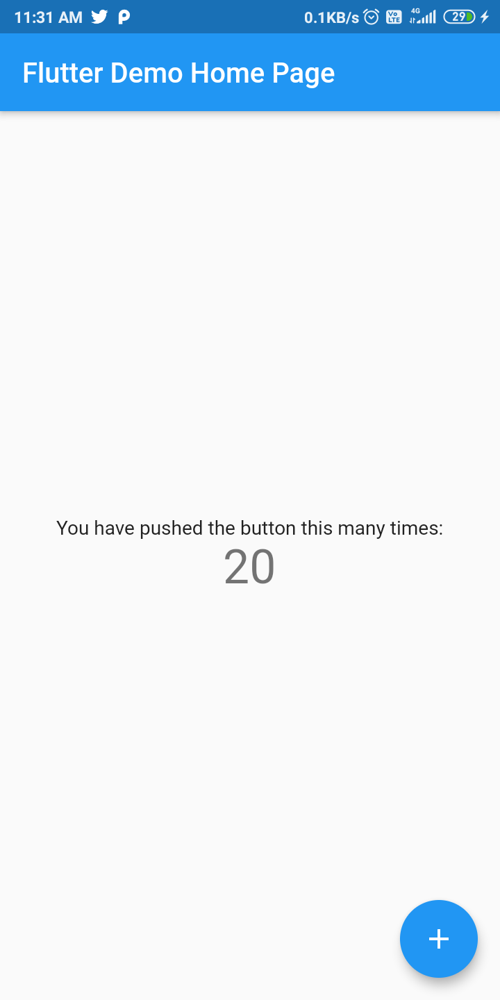

# ROS FLUTTER APP

Flutter Base Project for ROS Teleop Joy control.

## Screenshots

### Main Application


### Settings Page


The settings page allows users to configure:
- ROS connection (IP address and port)
- ROS topics (chatter, cmd_vel, counter)
- Camera settings (topic and port)

## Task List

- [x] Splash Screen
- [ ] BLoC Architecture
- [x] JoyStick
- [x] ROS send topic messages
- [ ] View Map
- [ ] Visualize URDF
- [x] Editable IP Address and topic names
- [ ] add files for the web camera and navigation map

## ROS launch files

```bash
roscore

export TURTLEBOT3_MODEL=waffle

roslaunch turtlebot3_gazebo turtlebot3_empty_world.launch

roslaunch rosbridge_server rosbridge_websocket.launch


```
